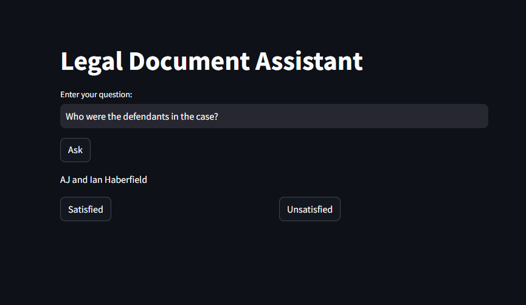
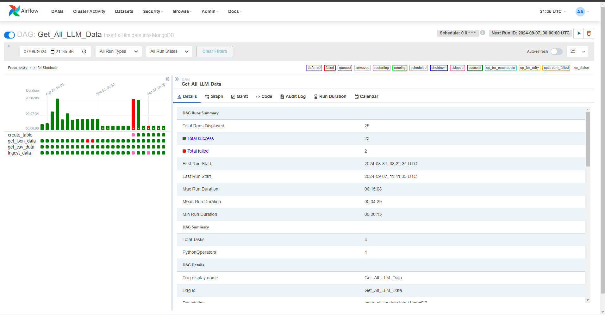

# Background

In today's legal industry, the sheer volume of legal documents, case laws, and statutes available can be overwhelming for lawyers and legal professionals. Efficiently managing and retrieving relevant legal information is crucial to building a strong case or providing timely advice to clients. However, the manual process of sifting through extensive documents can be time-consuming and prone to human error. The evolution of technology, particularly in artificial intelligence (AI) and natural language processing (NLP), has opened new avenues for enhancing legal research processes. By utilizing advanced AI models such as large language models (LLMs) and techniques like Retrieval-Augmented Generation (RAG), it is now possible to automate the retrieval of legal information with high accuracy and relevance.

# Problem Statement

Law firms and legal professionals face significant challenges in managing large collections of legal documents, case laws, and statutes. The manual process of searching for relevant information is not only time-consuming but also inefficient, as it may lead to missing critical information or wasting valuable resources on non-essential documents. Existing legal research tools often fail to provide contextually relevant suggestions or insights, limiting their usefulness in complex cases. The need for a system that can quickly, accurately, and contextually retrieve relevant legal documents is more pressing than ever.

# Solution

The Legal Document Assistant aims to solve these challenges by implementing a Retrieval-Augmented Generation (RAG) approach, combined with a powerful large language model (LLM). This system allows law firms to efficiently query vast collections of legal documents and receive contextually accurate answer. By integrating LLM with a knowledge base, the application provides lawyers with instant access to relevant case laws, legal precedents, statutes, and other legal documents. The assistant can streamline legal research, reduce the time spent on manual searches, and ensure that critical information is not overlooked, ultimately improving the legal research process and enhancing decision-making capabilities.


## RAG Flow


### Dataset

- https://www.kaggle.com/datasets/umarbutler/open-australian-legal-qa/data?select=qa.jsonl
- https://www.kaggle.com/datasets/amohankumar/legal-text-classification-dataset

### Tech Stack

The Legal Document Assistant leverages a combination of cutting-edge technologies and tools to provide an efficient and scalable solution for legal document management and retrieval. Below is an overview of the key components of the tech stack:

- Python: The core language used for developing the application, enabling seamless integration of machine learning models, data processing, and backend services.
- Streamlit: A lightweight web framework used to create an intuitive and interactive user interface (UI) for the Legal Document Assistant. Streamlit allows lawyers and legal professionals to interact with the system effortlessly, providing a seamless experience for querying documents and retrieving legal information.
- Airflow: A powerful orchestration tool used to manage and schedule workflows, ensuring that data ingestion, processing, and retrieval tasks are automated and run efficiently.
- Elasticsearch: A distributed search engine used to index and query large collections of legal documents. Elasticsearch allows for fast and efficient full-text search, ensuring that relevant case laws, statutes, and legal documents can be retrieved quickly.
- Google BERT LLM Model: The Google BERT (Bidirectional Encoder Representations from Transformers) model is employed to enhance the retrieval-augmented generation (RAG) flow. This large language model provides contextually accurate suggestions, summaries, and insights based on user queries, making the search results more meaningful and relevant.
- Grafana: A real-time monitoring and visualization tool used to track the performance of the application. It allows developers and administrators to gain insights into system health, query performance, and other important metrics to ensure smooth operations.
- Docker: Used to containerize the entire application, ensuring consistency across different environments and simplifying deployment. Docker ensures that all services (e.g., Airflow, Elasticsearch, BERT model, Grafana) are isolated, scalable, and easy to manage.

### Retrieval

In the retrieval phase, the Legal Document Assistant utilizes both **PostgreSQL** and **Elasticsearch** to efficiently process and answer user queries by combining structured data storage and high-performance search capabilities.

1. Dataset Storage and Indexing: Legal documents, case laws, and statutes are stored in a PostgreSQL database. This relational database organizes the dataset, maintaining the structure and integrity of the legal information. PostgreSQL stores detailed metadata, including document types, case names, statutes, and related legal details. To enhance search performance, an index of this dataset is created in Elasticsearch, allowing for faster retrieval of relevant information.

2. Search via Elasticsearch: Once the PostgreSQL dataset is indexed into Elasticsearch, it enables full-text search across the stored documents. When a user submits a query, Elasticsearch performs a fast, scalable search, looking through the indexed documents for matches based on the user's question. Elasticsearch uses advanced ranking algorithms to ensure the most relevant legal documents are returned. The results are filtered and ranked by relevance, offering accurate and contextually appropriate legal information.

By indexing the dataset from PostgreSQL into Elasticsearch, the retrieval process becomes faster and more efficient, allowing the Legal Document Assistant to quickly access and return the most relevant documents in response to user queries.

### Retrieval-Augmented Generation (RAG)
The Legal Document Assistant employs a Retrieval-Augmented Generation (RAG) approach to provide contextually accurate responses based on user queries. This step combines the retrieval power of Elasticsearch with the language generation capabilities of the [google-bert/bert-large-uncased-whole-word-masking-finetuned-squad](https://huggingface.co/google-bert/bert-large-uncased-whole-word-masking-finetuned-squad?context=In+Nasr+v+NRMA+Insurance+%5B2006%5D+NSWSC+1018%2C+the+plaintiff%27s+appeal+was+lodged+out+of+time+because+the+summons+was+filed+on+8+June+2006%2C+seven+months+after+the+decision+of+the+Local+Court+was+made+on+4+October+2005.+No+explanation+was+provided+for+this+delay.&text=In+the+case+of+Nasr+v+NRMA+Insurance+%5B2006%5D+NSWSC+1018%2C+why+was+the+plaintiff%27s+appeal+lodged+out+of+time%3F) from Hugging Face.

1. Integration with Google BERT API: To enhance the relevance and quality of the search results, the application leverages the Google BERT (Bidirectional Encoder Representations from Transformers) model via the Hugging Face API. This model enables the system to generate summaries, suggestions, and context-aware insights based on the retrieved legal documents. The BERT model interprets the user’s query and provides responses that are contextually aligned with legal texts.
2. Hugging Face API Key: In order to use the Google BERT model from Hugging Face, the application requires an API key (HUGGINGFACE_KEY) from the Hugging Face platform. This key provides access to the BERT API and must be securely stored in the environment configuration.
3. Docker Compose Setup: The HUGGINGFACE_KEY is integrated into the system using Docker Compose. The API key is placed within the Docker Compose environment file, ensuring secure access during runtime. Here’s how the key is added:
```
  app:
    build: llm-app/.
    container_name: llm_app
    environment:
      - HUGGINGFACE_KEY=<YOUR_API_KEY>
    volumes:
      - ./llm-app/:/app
    networks:
      - network
    depends_on:
      - elasticsearch
    ports:
      - "8501:8501"
```

This allows the Legal Document Assistant to seamlessly interact with the Hugging Face API for enhanced document retrieval and generation, ensuring that the output is contextually relevant and precise.

### Interface



The Legal Document Assistant provides an intuitive and user-friendly interface built using Streamlit. The interface is designed to allow legal professionals to easily interact with the system, submit queries, and provide feedback on the results. Key features of the interface include:

1. Text Input Field: Users can enter their legal questions or queries into the text field. This input is sent to the system, which processes the query through the Retrieval-Augmented Generation (RAG) pipeline to return relevant legal documents and summaries.
2. Ask Button: After entering a query, users click the Ask button to submit their question. The system then retrieves and generates responses based on the user input, leveraging Elasticsearch for document search and the Google BERT model for contextual generation.
3. Satisfaction Button: Once the results are displayed, users can provide feedback on the accuracy and relevance of the retrieved documents and generated summaries by clicking the Satisfaction button. This feedback helps monitor the quality of the responses and can be used for system improvement and performance tracking.

The Streamlit interface ensures a smooth and seamless user experience, allowing legal professionals to efficiently query the system and interact with the results.

### Ingestion Pipeline



The data ingestion process involves loading legal documents from CSV and JSON files into PostgreSQL and indexing them into Elasticsearch. This is managed using **Apache Airflow**.

1. Data Extraction
CSV & JSON: Airflow extracts data from CSV and JSON files, converting it into a suitable format for PostgreSQL.
2. Data Loading
PostgreSQL: The extracted data is cleaned, transformed, and loaded into PostgreSQL tables using Airflow.
3. Data Indexing
Elasticsearch: Data is exported from PostgreSQL, indexed into Elasticsearch with appropriate mappings for efficient search.
4. Monitoring
Airflow monitors the pipeline for performance and errors, ensuring data integrity and prompt issue resolution.

### Evaluation

### Dashboard

## How to run

